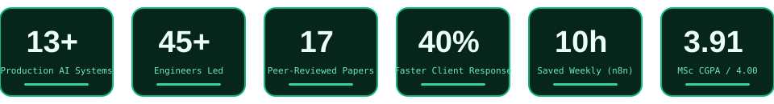

  

  

## ⚡ Executive Profile

AI/ML engineer and data scientist who designs, ships, and scales deep learning pipelines, computer vision frameworks, NLP solutions, and enterprise RAG engines. Winner of an international **Best Paper Award**, author of **17 peer-reviewed publications**, and team leader driving sprint planning, model R&D, and production releases for a **45+ member AI engineering team**.

- 📍 **Location:** 93 South Bashabo, Dhaka-1214, Bangladesh
- 🗣️ **Languages:** English (Advanced, C1) · Bengali (Native)
- 🔬 **Research focus:** Agricultural computer vision, self-supervised learning (BYOL, DINO, SimCLR), graph convolutional networks, explainable AI (SHAP), knowledge graphs
- 🎯 **Interests:** Data science and analytics, traveling, football

## 🧰 Skill Matrix

  
  

<b>▸ Full toolchain</b>

 

| Layer | Stack |
| :--- | :--- |
| **Languages** | Python · JavaScript · SQL · C · C++ · Java · HTML · CSS |
| **Frameworks** | Django · FastAPI · TensorFlow · PyTorch · Scikit-learn · Streamlit |
| **AI / ML** | Deep Learning · NLP · Computer Vision · OCR · RAG Pipelines · LLMs · Generative AI · Explainable AI (SHAP) · Knowledge Graphs |
| **Automation & MLOps** | n8n · LLM Chaining · Webhook Systems · OpenAI API · FAISS · Prompt Engineering |
| **Tools** | Jupyter Notebook · Google Colab · Roboflow · Kaggle · Oracle APEX · VS Code · Git |

## 🚀 Featured Deployments

<table>
  <tr>
    <td width="50%" valign="top">
      <h4>🧾 AI Invoice Voucher Processing</h4>
      
GPT-4o Vision pipeline that extracts invoice data, classifies GL accounts and profit centres, and generates payment vouchers with confidence-based review.

      <code>GPT-4o Vision</code> <code>Streamlit</code> <code>Fiverr</code>
    </td>
    <td width="50%" valign="top">
      <h4>🚑 HealthRide — Autonomous NEMT Platform</h4>
      
24/7 GPT-4o voice receptionist and AI dispatch engine with real-time driver matching across 6 event triggers.

      <code>Voice AI</code> <code>Dispatch</code> <code>GPT-4o</code>
    </td>
  </tr>
  <tr>
    <td width="50%" valign="top">
      <h4>🧠 EmoThrive — AI Therapeutic Assistant</h4>
      
Voice-enabled LLM assistant with PDF-backed knowledge retrieval, speech recognition, and a RAG workflow.

      
    </td>
    <td width="50%" valign="top">
      <h4>🏆 OP Mental Performance AI Coach</h4>
      
Performance-focused AI coaching assistant, deployed live.

      
    </td>
  </tr>
  <tr>
    <td width="50%" valign="top">
      <h4>🌴 BhromonGhuri — Travel & Tour Booking</h4>
      
Full-stack tourism platform with zero-reload filtering, instant pricing, and bKash/Nagad payment verification.

      <code>Django 5</code> <code>HTMX</code> <code>Alpine.js</code> <code>Tailwind</code>
    </td>
    <td width="50%" valign="top">
      <h4>🚗 Smart Mobility Platform (Uber / Pathao style)</h4>
      
Real-time proximity dispatch with live vehicle telemetry and geofenced surge pricing.

      <code>FastAPI</code> <code>WebSockets</code> <code>Redis Geo</code> <code>PostGIS</code> · <i>In active development</i>
    </td>
  </tr>
</table>

<b>▸ More production &amp; applied AI work</b>

 

- 🍽️ **Eat at Home — AI Meal Cost Estimator:** GPT-4o model with store-tier blending and ZIP-code regional pricing multipliers.
- 📚 **Enterprise RAG System:** FAISS embeddings + OpenAI LLMs delivering context-aware answers across 500+ document chunks.
- ✍️ **Hebrew/Yiddish Handwriting Transcription:** Cursive OCR pipeline on GPT-4o and Claude Vision with CER-based accuracy evaluation.
- 📄 **OCR Text Extraction System:** Scalable multi-format document ingestion with structured text output.
- 🎬 **Nory0929 — Video-Based Auto Marketplace:** Multimodal agent (Kling 2.5 + OpenAI) turning 5+ vehicle images and an optional prompt into 25-second, 720p marketing videos.
- 🔁 **n8n AI Video Generation Automation:** End-to-end API-chained video production, cutting manual effort by ~80%.
- 🚦 **Vehicle Detection & Traffic Flow Prediction:** Deep learning models trained on the TFP-BD dataset for Bangladeshi urban roads.

## 💼 Professional Experience

<table>
  <thead>
    <tr>
      <th width="32%">Role</th>
      <th width="18%">Timeline</th>
      <th width="50%">Impact</th>
    </tr>
  </thead>
  <tbody>
    <tr>
      <td><b>Senior Executive Data Scientist &amp; Team Leader</b> <em>Join Venture Ai (JVai) · Betopia Group</em></td>
      <td><code>06/2025 – 10/2026</code> Dhaka, Bangladesh</td>
      <td>
        ⚙️ Developed <b>13+ production AI systems</b> (RAG chatbots, NLP tools), cutting client response time by <b>40%</b> 
        👥 Led a <b>45+ member AI team</b> across R&amp;D sprints, technical planning, and on-schedule client delivery 
        🔁 Automated <b>n8n workflows</b> with webhook triggers and OpenAI/email APIs, saving <b>10 hrs/week</b> 
        📈 Built AI-enabled lead generation tools with the sales team to sharpen pipeline efficiency and prospect qualification
      </td>
    </tr>
    <tr>
      <td><b>Graduate Teaching Assistant</b> <em>East West University</em></td>
      <td><code>10/2024 – 12/2025</code> Dhaka, Bangladesh</td>
      <td>
        🎓 Taught lectures and labs for <b>Statistics, AI, and Machine Learning</b> to 70+ graduate students per semester 
        🧭 Guided <b>90+ students</b> through advanced ML projects and data analysis
      </td>
    </tr>
    <tr>
      <td><b>Research Assistant</b> <em>East West University</em></td>
      <td><code>10/2024 – 12/2025</code> Dhaka, Bangladesh</td>
      <td>
        📝 Co-authored <b>17 peer-reviewed publications</b> in Data Science, Computer Vision, and NLP 
        🗂️ Supported the <b>TFP-BD</b> traffic flow and pedestrian dataset, published in <i>Data in Brief</i> (Vol. 59, 2025)
      </td>
    </tr>
  </tbody>
</table>

## 🏅 Awards & Selected Publications

> ### 🥇 Best Paper Award — AII 2025
> 5th International Conference on Applied Intelligence and Informatics · Washington, D.C., USA
> **CodeMixEcom-Emotion:** A Large-Scale Bangla–English Review Corpus and Transformer-Based Benchmark for Fine-Grained Emotion Detection · Springer-Nature CCIS (2025)

| Domain | Publication | Venue |
| :--- | :--- | :--- |
| 🩻 Medical Imaging | Towards Annotation-Efficient Kidney CT Scan Classification: Supervised and Semi-Supervised Swin Transformer Frameworks | IEEE SPICSCON 2025 |
| 🔬 Oncology | Histopathology images-based deep learning prediction of prognosis and therapeutic response in small cell lung cancer | Springer ICDMIS 2024 |
| 🚦 Datasets | TFP-BD: An image dataset for Traffic Flow and Pedestrian movement analysis on Bangladeshi urban roads | *Data in Brief*, Vol. 59, 111398 (2025) |
| 🫁 Diagnostics | Tuberculosis Diagnosis from Chest X-Ray Image Using Deep Learning Techniques | IEEE ICAECT 2025 · [10.1109/ICAECT63952.2025.10958925](https://doi.org/10.1109/ICAECT63952.2025.10958925) |
| 🍄 Smart Agriculture | Real-time monitoring of oyster mushroom cultivation using CCTV and attention-enhanced ShuffleNet-based explainable AI | *Smart Agricultural Technology*, Vol. 12, 101571 (2025) · [DOI](https://doi.org/10.1016/j.atech.2025.101571) |
| 💊 Explainable AI | Interpretable Illness-Category Classification from Drug Attributes Using XGBoost with SHAP Explanations | IEEE QPAIN 2025 · [10.1109/QPAIN66474.2025.11172160](https://doi.org/10.1109/QPAIN66474.2025.11172160) |

## 🎓 Education

| Qualification | Institution | Session | Standing |
| :--- | :--- | :--- | :--- |
| **M.Sc. in CSE** (Major: Data Science) | East West University | 01/2025 – 12/2025 | **CGPA 3.91 / 4.00** |
| **B.Sc. in CSE** | East West University | 01/2020 – 07/2024 | **CGPA 3.58 / 4.00** |
| **HSC** | National Ideal College | 2017 – 2019 | GPA 4.67 / 5.00 |
| **SSC** | Motijheel Model School And College | 2016 – 2017 | GPA 5.00 / 5.00 |

- **M.Sc. Thesis:** Self-Supervised Learning and Graph-Refined Object Detection Framework for Precision Agriculture
- **B.Sc. Thesis:** Tuberculosis Diagnosis from Chest X-Ray Image Using Deep Learning Techniques

